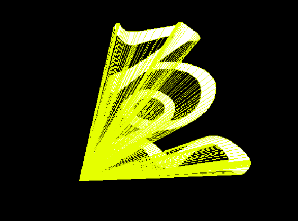
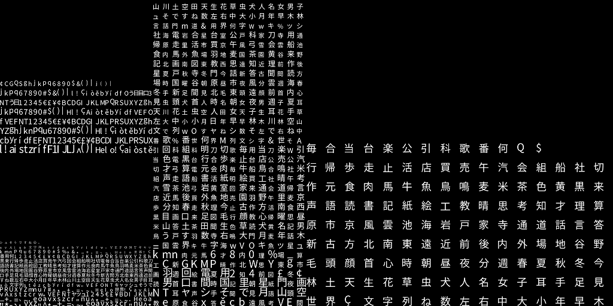
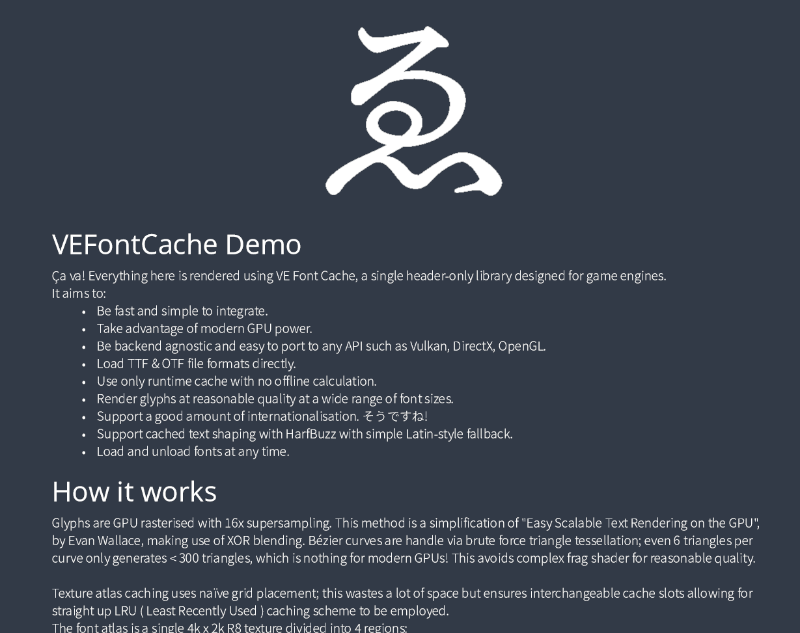
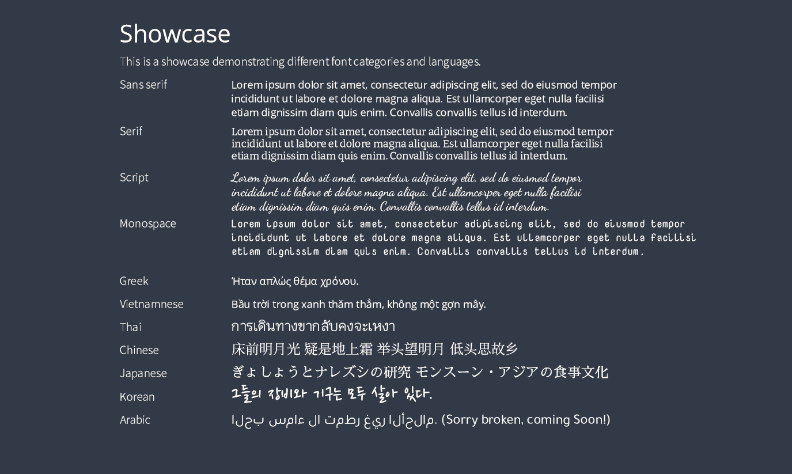
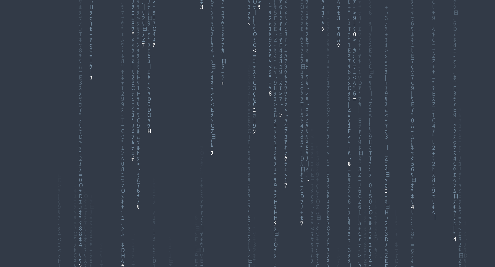

VEFontCache is a single header-only library designed for game engines.

It aims to:
 * Be fast and simple to integrate.
 * Take advantage of modern GPU power.
 * Be backend agnostic and easy to port to any API such as Vulkan, DirectX, OpenGL.
 * Load TTF & OTF file formats directly.
 * Use only runtime cache with no offline calculation.
 * Render glyphs at reasonable quality at a wide range of font sizes.
 * Support a good amount of internationalisation. そうですね!
 * Support cached text shaping with HarfBuzz with simple Latin-style fallback.
 * Load and unload fonts at any time.

# How it works

Glyphs are GPU rasterised with 16x supersampling. This method is a simplification of "Easy Scalable Text Rendering on the GPU",
by Evan Wallace, making use of XOR blending. Bézier curves are handled via brute force triangle tessellation; even 6 triangles per
curve only generates < 300 triangles, which is nothing for modern GPUs! This avoids complex frag shader for reasonable quality.



Texture atlas caching uses naïve grid placement; this wastes a lot of space but ensures interchangeable cache slots allowing for
straight up LRU ( Least Recently Used ) caching scheme to be employed.

The font atlas is a single 4k x 2k R8 texture divided into 4 regions:

```
     2k
     --------------------
     |         |        |
     |    A    |        |
     |         |        | 2
     |---------|    C   | k  
     |         |        |
  1k |    B    |        |
     |         |        |
     --------------------
     |                  |
     |                  |
     |                  | 2
     |        D         | k  
     |                  |
     |                  |
     |                  |
     --------------------        
               
     Region A = 32x32 caches, 1024 glyphs
     Region B = 32x64 caches, 512 glyphs
     Region C = 64x64 caches, 512 glyphs
     Region D = 128x128 caches, 256 glyphs
```

Region A is designed for small glyphs, Region B is for tall glyphs, Region C is for large glyphs, and Region D for huge glyphs.
Glyphs are first rendered to an intermediate 2k x 512px R8 texture. This allows for minimum 4 Region D glyphs supersampled at
4 x 4 = 16x supersampling, and 8 Region C glyphs similarly. A simple 16-tap box downsample shader is then used to blit from this
intermediate texture to the final atlas location.

The atlas texture looks something like this:


# Usage

Pseudo-code demonstrating simple usage:
```cpp
#define VE_FONTCACHE_IMPL
#include "../ve_fontcache.h"

static std::vector< uint8_t > buffer;
ve_fontcache_init( &cache );
ve_fontcache_configure_snap( &cache, width, height );
print_font = ve_fontcache_loadfile( &cache, "fonts/NotoSansJP-Light.otf", buffer, 19.0f );
ve_fontcache_draw_text( &cache, print_font, u8"hello world", 0, 0, 1.0f / width,  1.0f / height );
```

These header files need to be copied to your project:
```
ve_fontcache.h
utf8.h
stb_truetype.h
```

Except HarfBuzz, that's all the required dependencies. That said it's strongly recommended
to use HarfBuzz ( TODO: HarfBuzz not supported yet, coming soon!! ) over the default utf8.h latin
fallback text shaper.

## Integration with rendering backend

VEFontCache is largely backend agnostic. Currently the demo project uses OpenGL 3.3 for Windows.
That said it's designed to be integrated with VE, a Vulkan engine.
Please read the "How to plug into rendering API" section in ve_fontcache.h for more documentation
on how to implement your own backend to plumb this directly into your engine!

# Screenshots







